# CustomRenderer

A GPU renderer written with CUDA for the Computer Graphics lecture at ETH Zurich.

The Syntax is inspired by the [educational ray tracer Nori](https://wjakob.github.io/nori/#about). 

There are still a lot of open TODO's and ideas which may hopefully be explored in the future.


## Usage

First clone the repository and initialize the submodules using `git submodule update --init --recursive`.

If all the prerequisites are installed, the executable can be generated using the following commands:
```
mkdir build
cd build
cmake ..
make 
```

or `make -j 6` to make use of 6 threads


To run the script from the root folder, run the command

`./build/CustomRenderer scenes/cbox.xml` or the path to any other compatible scene description file.


This will run a live-preview of the rendering progress.

Until the image completes, the camera can be moved around using WASD/Left Shift/Space to translate the camera and adjust the shot.

The GUI might not display correctly on the first launch and might require the adjustment of the sub-window sizes.

The tonemapping in the live preview is incorrect at this point and displays images darker than they will be if gamma correction is applied correctly.

The (correctly) tonemapped image will be saved in the `data` folder.

The renderer was developed and tested on Arch Linux btw.

## Example Images


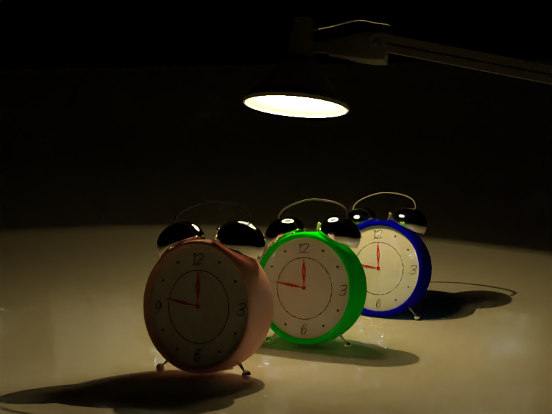

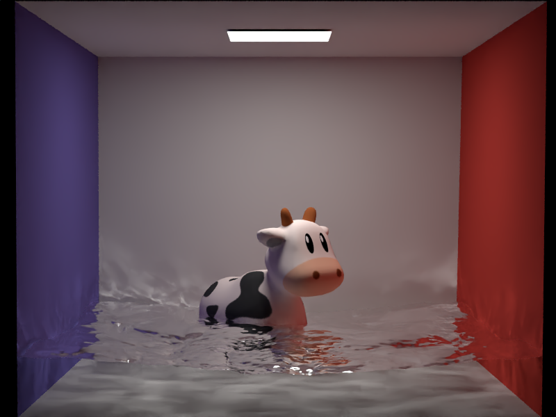


## Special Features

#### Adaptive Sampling
|                Test Scene                |               Sample Distribution               |
|:----------------------------------------:|:-----------------------------------------------:|
| 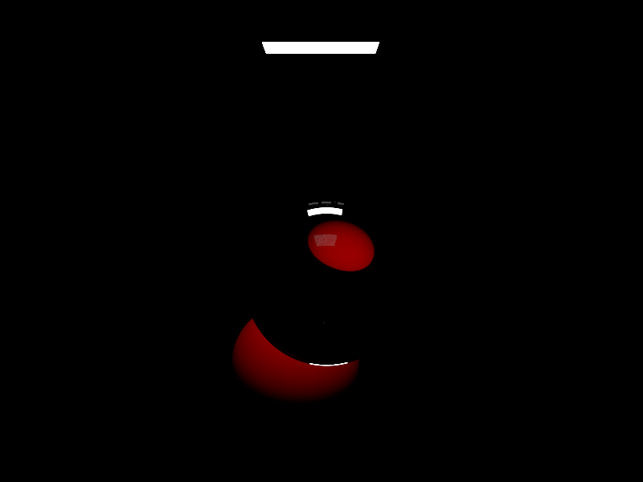 | 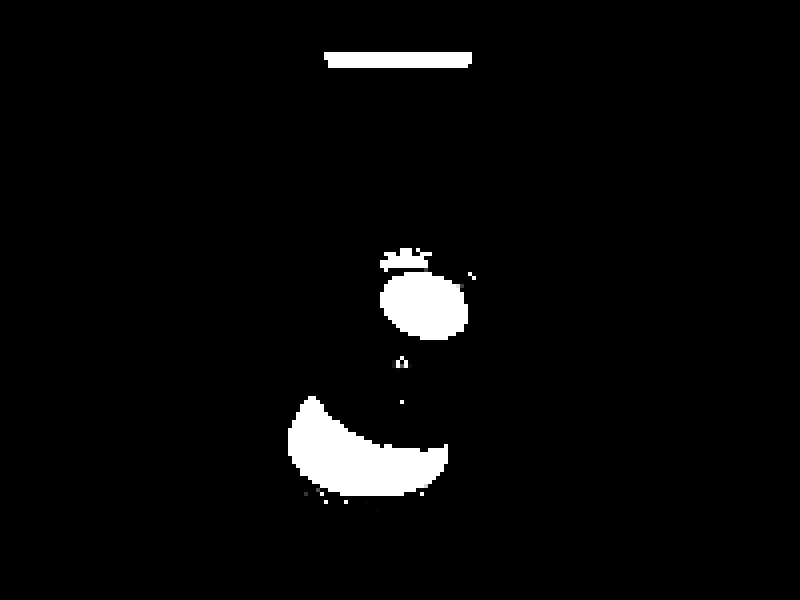 |


#### Advanced Camera Model

###### Depth of Field

|                  Test Scene                  |                 Depth of Field                 |
|:--------------------------------------------:|:----------------------------------------------:|
| 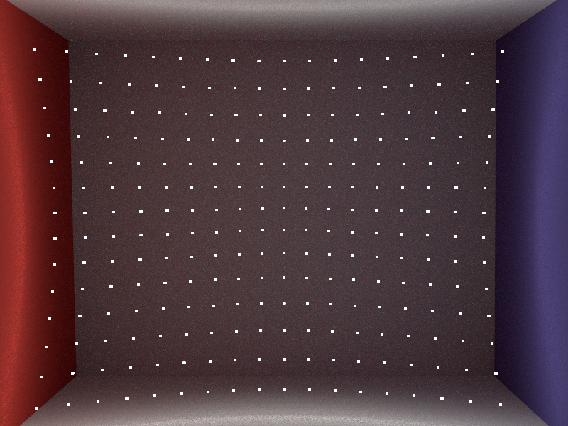 | 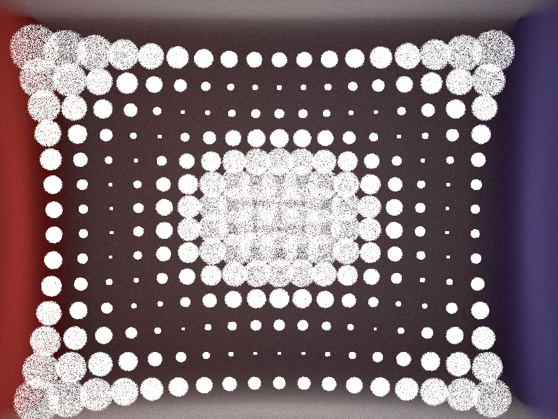 |


###### Distortion

|                  Test Scene                  |                    Distortion                    |
|:--------------------------------------------:|:------------------------------------------------:|
|  | 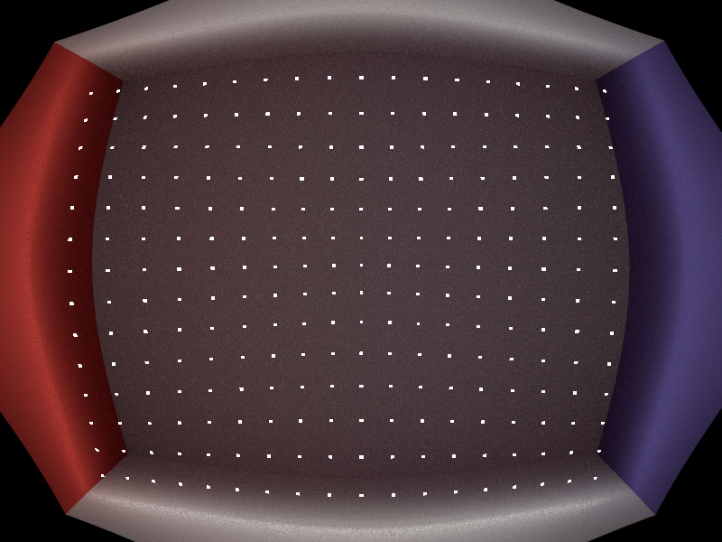 |

###### Non-Spherical Apertures

|               Spherical Aperture               |             Square Aperture              |            Triangular Aperture             |
|:----------------------------------------------:|:----------------------------------------:|:------------------------------------------:|
|  | 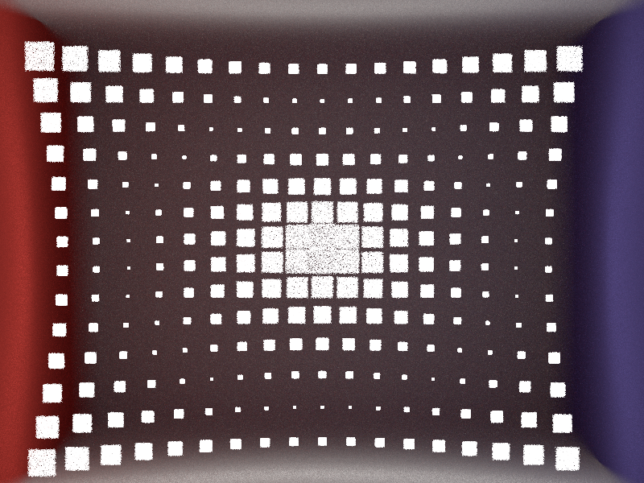 | 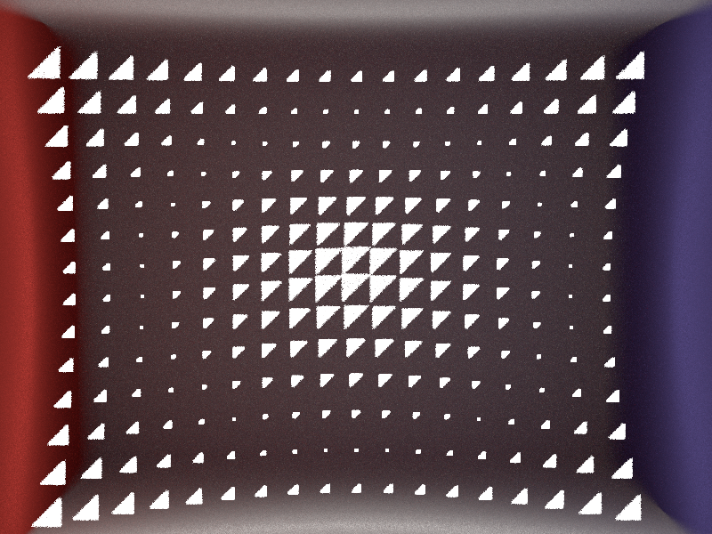 |


#### Denoising

###### Bilateral Filter 
|            Test Scene             |             Denoised Version              |              Variance Buffer              |
|:---------------------------------:|:-----------------------------------------:|:-----------------------------------------:|
| 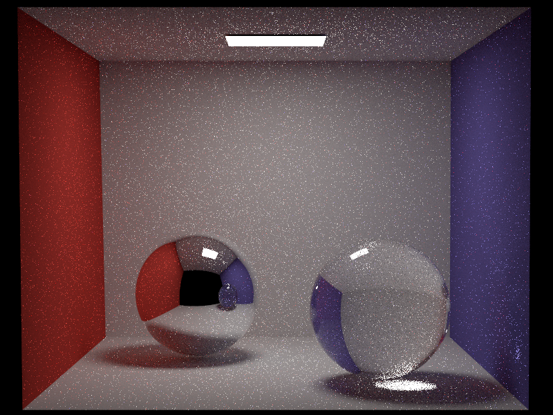 |  | 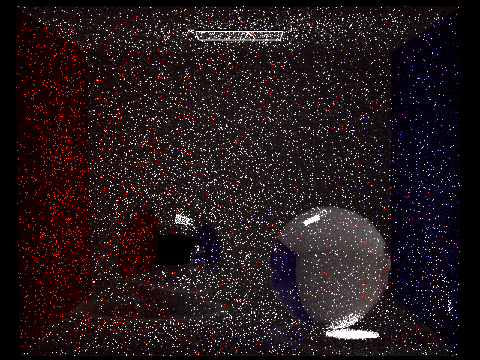 |

###### Intel Open Image Denoise with Color, Albedo and Normal Buffer
|              Test Scene               |               Denoised Version                |
|:-------------------------------------:|:---------------------------------------------:|
|  |  |


#### Environment Map

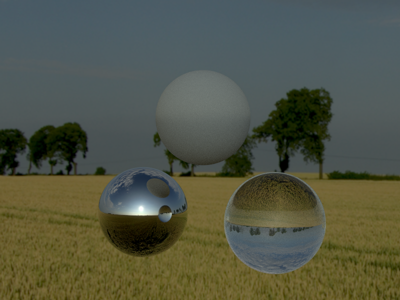


###### Importance Sampling

|        Environment Map        |          Sample Distribution           |
|:-----------------------------:|:--------------------------------------:|
|  | 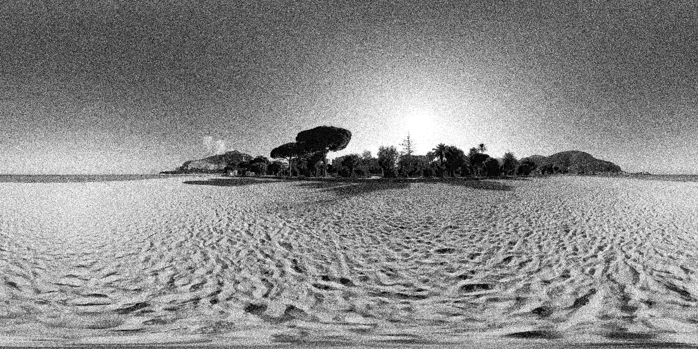 |


#### Textures

###### Mesh Textures
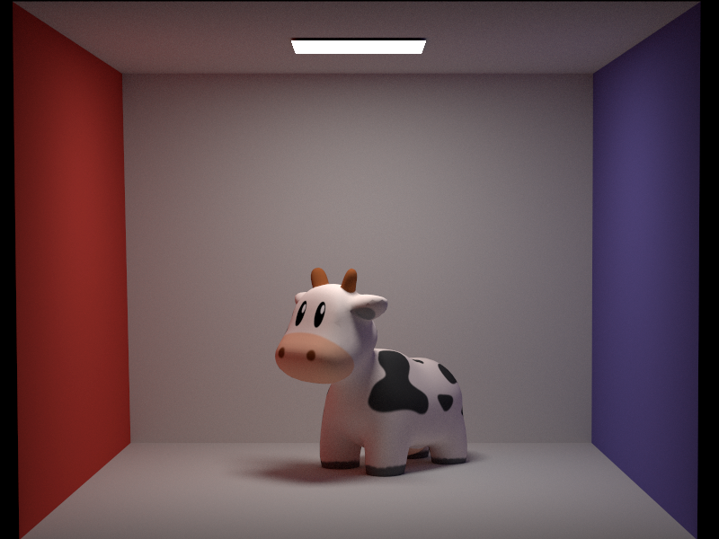

###### Mesh Emitter Textures
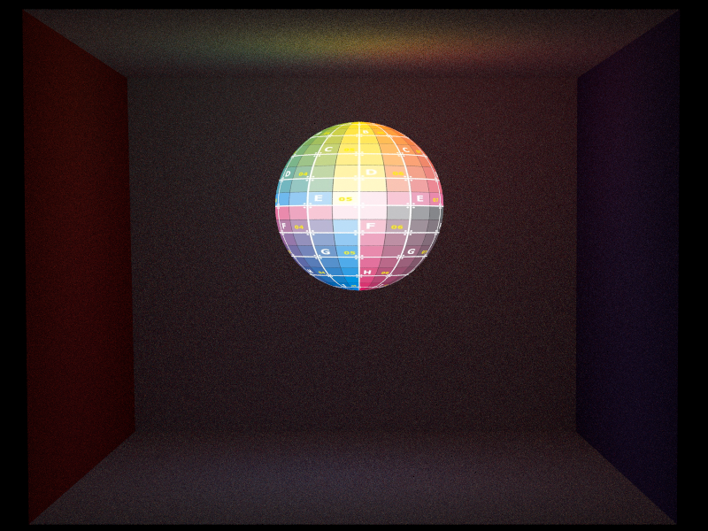

